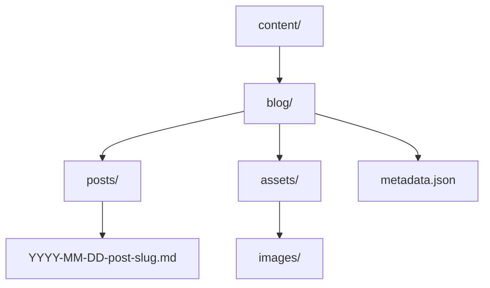

# Blog Content Management System Enhancement Plan

## 1. Content Structure



### Directory Structure
- `content/blog/` - Root directory for all blog content
- `content/blog/posts/` - Markdown files for each post
- `content/blog/assets/` - Images and other media
- `content/blog/metadata.json` - Optional metadata for posts (e.g., featured status)

## 2. Content Format

Each blog post will be a Markdown file with YAML frontmatter:

```yaml
---
title: Common Myths About Early Retirement
description: Debunking misconceptions about retiring before the traditional age of 65
category: Early Retirement
date: 2025-03-16
read_time: 2 min read
image: /static/images/WithdrawAge.png
card_image: /static/images/Savings.png
is_featured: true
---

## Understanding Early Retirement Reality

Many people believe that early retirement is only possible for the wealthy elite...
```

## 3. Implementation Plan

### Phase 1: File System Infrastructure
1. Create the new directory structure
2. Implement a MarkdownBlogRepository class
3. Add file system utilities for reading/writing posts

### Phase 2: Content Migration
1. Create migration script to convert existing HTML content to Markdown
2. Move existing blog posts to the new structure
3. Update image references

### Phase 3: Repository Enhancement
1. Implement file watching for live reload during development
2. Add caching layer for production performance
3. Implement search functionality using front matter

### Phase 4: Editing Workflow
1. Add CLI tools for creating new posts
2. Implement preview functionality
3. Add validation for front matter

## 4. Technical Details

### BlogPost Class Updates
```python
@dataclass
class BlogPost:
    # Existing fields remain the same
    content_path: str  # Path to the Markdown file
    raw_content: str  # Raw Markdown content
    html_content: str  # Rendered HTML (cached)
```

### New MarkdownBlogRepository
```python
class MarkdownBlogRepository(BlogRepository):
    def __init__(self, content_dir: str):
        self.content_dir = content_dir
        self.cache = {}  # In-memory cache
        
    def get_all(self) -> List[BlogPost]:
        # Read all markdown files
        # Parse frontmatter
        # Return sorted posts
        
    def get_by_id(self, post_id: str) -> Optional[BlogPost]:
        # Find markdown file by slug
        # Parse and return post
```

## 5. Benefits

1. **Better Content Management**
   - Markdown is easier to write and maintain
   - Clear separation of content and presentation
   - Version control friendly

2. **Enhanced Development Workflow**
   - Use any text editor for content
   - Preview changes locally
   - Better collaboration through PR reviews

3. **Future Extensibility**
   - Easy to add categories/tags
   - Support for different content types
   - Simple backup and migration

4. **Performance**
   - Content can be pre-rendered
   - Efficient caching
   - Static file serving