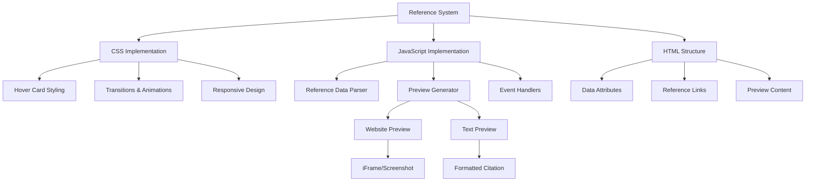

# Reference Hover Card Implementation Plan

## Overview
Implement hover cards for reference citations in blog posts. When users hover over reference numbers (e.g., [1]), a preview card will appear showing either:
- Website preview for web-based references
- Formatted citation text for non-web references

css should be in content.css, js should be in content_base.html

only change the first one reference in 003-retire-crash-year.html to ensure it work, before the rest.

The target intion is to remove the whole Refence section. User do not need to go to the bottom to see the detail.Converting reference citations into hover cards that show the full reference details immediately when users hover over them
This means users won't need to scroll to the bottom to check references, making the reading experience more seamless

## Technical Components

### 1. CSS Implementation
```css
.reference-hover-card {
  position: absolute;
  background: white;
  border-radius: 8px;
  box-shadow: 0 4px 12px rgba(0,0,0,0.15);
  padding: 1rem;
  width: 300px;
  z-index: 100;
  opacity: 0;
  transform: translateY(10px);
  transition: all 0.3s ease;
}

.reference-preview {
  max-height: 200px;
  overflow: hidden;
}

.website-preview {
  width: 100%;
  height: 150px;
  border: none;
}
```

### 2. JavaScript Implementation
```javascript
class ReferencePreview {
  constructor() {
    this.references = {};
    this.initializeReferences();
    this.attachEventListeners();
  }
  
  initializeReferences() {
    // Parse references section
    // Store reference data
  }
  
  showPreview(refNumber, event) {
    // Generate and show appropriate preview
  }
  
  createWebsitePreview(url) {
    // Create iframe or fetch website preview
  }
  
  createTextPreview(citation) {
    // Format and display citation text
  }
}
```

### 3. HTML Structure Updates
1. Add data attributes to reference numbers:
```html
<sup data-ref="1" data-ref-type="website">[1]</sup>
```

2. Link references to full citations:
```html
<p id="ref-1" data-ref-type="website" data-ref-url="https://example.com">
  [1] Author. (Year). Title. Source.
</p>
```

## Implementation Flow


## Next Steps
1. Implement CSS styles for hover cards
2. Create JavaScript class for reference handling
3. Update HTML structure with data attributes
4. Test different reference types
5. Add fallback for failed website previews
6. Ensure mobile compatibility