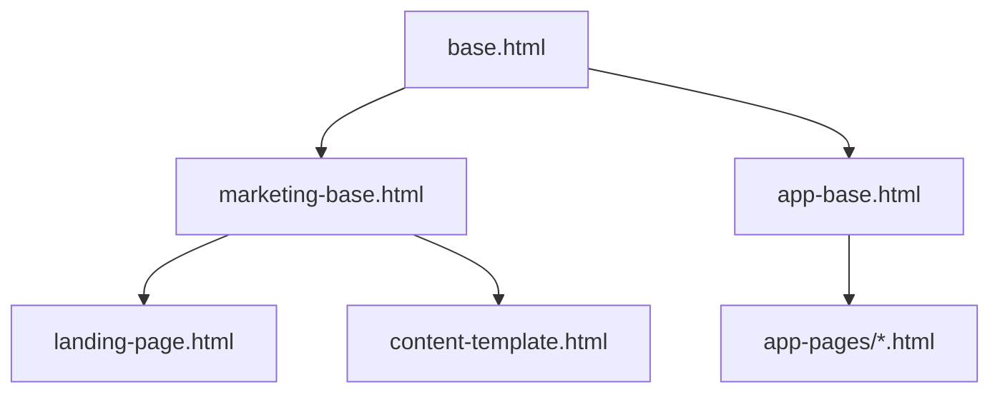

# Template Structure Plan for DynaRetire

## Overview

This document outlines the template structure for DynaRetire to maintain consistency while accommodating variations across different page types.

## Template Hierarchy



## 1. Core Template (base.html)

### Purpose
- Provides fundamental HTML structure
- Defines core blocks for extension
- Manages common meta tags and assets

### Key Blocks
```html






```

## 2. Marketing Base (marketing-base.html)

### Purpose
- Template for marketing/public-facing pages
- Full navigation and rich footer
- Enhanced SEO features

### Features
- Complete navigation menu
- Rich footer with links and social media
- Marketing-specific styles
- SEO optimization blocks
- Schema.org markup support

### Use Cases
- Landing page
- Feature showcase
- Blog posts
- Privacy policy

## 3. Application Base (app-base.html)

### Purpose
- Template for authenticated application pages
- Streamlined navigation
- Focus on functionality

### Features
- Simplified navigation
- Minimal footer
- Application-specific styles/scripts
- User session management
- Technical menu items

### Use Cases
- Dashboard
- Settings pages
- Data input forms
- Results/Analysis pages

## 4. Component Structure

### Navigation Component
```html

  
    <!-- Marketing navigation -->
    - Home
    - Features
    - Pricing
    - Blog
    - Login/Sign Up
  
    <!-- App navigation -->
    - Dashboard
    - Settings
    - Profile
    - Logout
  
    <!-- Content navigation -->
    - Home
    - Back to App
    - Help
  

```

### Footer Component
```html

  
    <!-- Marketing footer -->
    - Company Info
    - Social Links
    - Newsletter
    - Contact
  
    <!-- App footer -->
    - Copyright
    - Terms
    - Privacy
  
    <!-- Content footer -->
    - Copyright
    - Privacy
  

```

## 5. Style Management

### Core Styles
- Base styling
- Typography
- Grid system
- Color schemes

### Component-specific Styles
- Navigation variations
- Footer variations
- Forms
- Buttons

### Page-specific Styles
- Marketing pages
- Application pages
- Content pages

## Implementation Steps

1. Create base templates:
   - base.html
   - marketing-base.html
   - app-base.html

2. Develop components:
   - Navigation variations
   - Footer variations
   - Common UI elements

3. Set up style hierarchy:
   - Core styles
   - Component styles
   - Page-specific styles

4. Implement template inheritance:
   - Landing page
   - Content pages
   - Application pages

5. Add customization hooks:
   - Style override blocks
   - Content blocks
   - Script blocks

## Benefits

1. **Consistency**
   - Unified base structure
   - Consistent styling
   - Common components

2. **Flexibility**
   - Easy customization
   - Page-specific variations
   - Component variations

3. **Maintainability**
   - Clear hierarchy
   - Reusable components
   - Organized structure

4. **Performance**
   - Optimized asset loading
   - Component-based structure
   - Efficient caching

## Technical Considerations

1. **Asset Management**
   - Proper CSS/JS loading order
   - Component-specific assets
   - Caching strategies

2. **Responsive Design**
   - Mobile-first approach
   - Flexible layouts
   - Adaptive components

3. **SEO**
   - Proper meta tags
   - Schema.org markup
   - Social media tags

4. **Performance**
   - Lazy loading
   - Asset optimization
   - Cache management